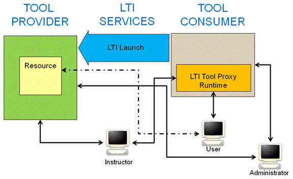
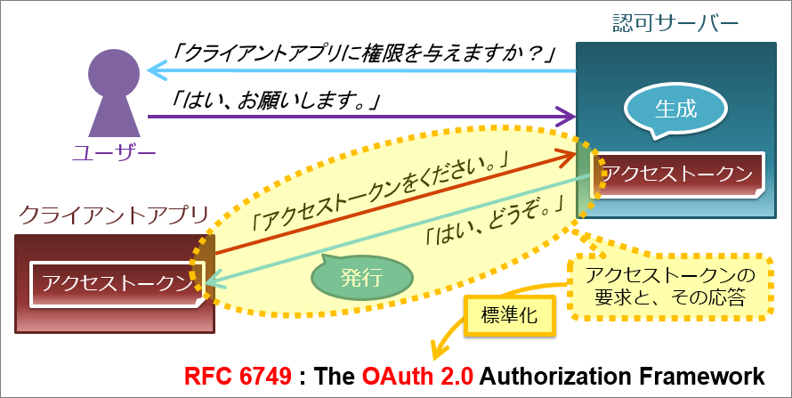
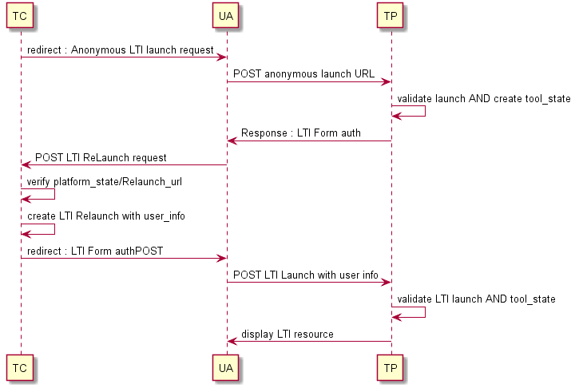
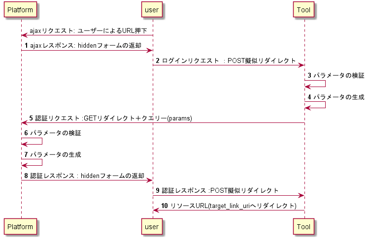

# LTI(Learning Tools Interoperability)について 
# 目次
[1.概要](#1.概要)  
[2.関連技術](#2.関連技術)  
[3.LTIv1.1.1](#3.LTIv1.1.1)  
[4.LTIv1.1.2](#4.LTIv1.1.2)  
[5.LTIv1.3](#5.LTIv1.3)  

# 1. 概要  
LTI(Learning Tools Interoperability)とは、[IMS Global Learning Consortium](http://www.imsglobal.org/)(以降IMS)が策定した、LMS(Learning Management System)と学習ツール(何らかの教材やサービスを提供)間で、やり取りする為のプロトコルである。(図１参照)  
要は、eラーニングシステムで使用される通信規約(通信データ構造等に関する)。
このLTI仕様はバージョンがあり、詳細は後述のセクションで解説するが、以下の様なものがある。  
また、LTIが使用されるシステム構成例(図１)も併せて記載する。  

|バージョン|関連技術|
|:--|:--|
|LTIv1.1.1|OAuth1.0を採用|
|LTIv1.1.2|OAuth1.0＋v1.1.1のセキュリティ強化版|
|LTIv1.3|OAuth2.0を採用|

| |
|:--:|
||
|図１.LTI 概要図|


|名称|内容|備考|
|:--|:--|:--|
|Tool Provider(ツール)|学習ツール(教材)を提供するサーバ|v1.3では"ツール"へと定義変更|
|Tool Consumer(プラットフォーム)|LMS。ユーザーはLMS経由で学習ツールを使用する|v1.3では"プラットフォーム"へと定義変更|
|LTI Service|LTIプロトコルの事|この中に何度もリダイレクトによるやり取りがある|
|User/Instructor/Admin|利用者(ブラウザ)、エンドユーザー||


# 2. 関連技術
### LMS(Learning Management System)
学習教材の配信や成績などを統合して管理するシステムの事。   
eラーニングにおけるプラットフォーム(OS)の様な役割。
 (あくまでメインは受講情報などの管理である為、教材(コース)は別のツールで作成されたものを利用することも多い。勿論LMSでテストなどの教材は作成可能)  
 具体的な機能としては、大まかに以下の様なものを備えている。
 - 受講ユーザー管理、教材管理
 - 教材の提供・配信
 - 受講履歴、進捗

|LMS名|備考|
|:--|:--|
|Moodle|かつてのNo1。今は使いづらいと評判悪い|
|Canvas|現在のシェアNo1|
|Sakai|謎|

### SCORM(Shareable Content Object Reference Model)  
eラーニングにおける標準規格であり、異なるLMS上で教材を扱う為の仕様である。
各社独自規格のLMS上で、教材を共有できるようにする為のインターフェース的な役割。  
LTIはツール側にアクセスして、ツール側のサーバで実行されるのに対し、SCORMは教材自体をプラットフォーム側(LMS)にもってきて実行するイメージ。
仕組みは大きく分けて以下の通り。  
1. ランタイム環境  
  LMSで用意されるAPIアダプタ。  
  学習コンテンツとLMS間で履歴データをやり取りする為の仲介役。  
  (学習コンテンツとLMSで直接やり取りしない)    
  つまりLMSが変わっても、各LMSで提供するAPIアダプタはSCORM仕様に従っている為、学習コンテンツ側は改修の必要がない。  
  
2. コンテンツアグリゲーション  
  学習コンテンツを流通させる為の情報(検索や再利用性)に関する定義(XML)。   
  XMLの内容は、関連キーワードや製作者、バージョン、紹介文などの情報。   
  XMLと学習コンテンツをzipでパッケージングして、LMSに登録する。  
  こうすることで、SCORM準処のLMSであれば教材を流用できるといった感じ。
  具体的な流れは、以下の通り。
    - 規定のXMLフォーマットに記入する。
    - XMLファイルを学習コンテンツと一緒にパッケージングし、LMSに登録する。
    - LMSが登録されたXMLを解釈し、教材情報一覧を生成する。
    - LMSは上記の登録情報から、目的に合った教材を抽出し、実行する。

### OAuth1.0/2.0
ざっくり言うと認可に関する規定。  
"1.0"は署名が必要であり、脆弱性有り。  
"2.0"はSSL/TLSが採用され、署名の必要がなくなった。  
OAuth1.0と2.0の互換性はないが、共存は可能である。[https://openid-foundation-japan.github.io/rfc6749.ja.html#anchor3](https://openid-foundation-japan.github.io/rfc6749.ja.html#anchor3)
クライアントがOAuthサーバーよりアクセストークンを受取り、これを元に認可サーバで認可を受けてリソースを受け取る。

| |
|:--:|
||
|図2.OAuth2.0 構成図|　


上図のフローを文章で書くと以下の通り。  
1. ユーザーがクライアントアプリへリクエストを投げる。  
2. クライアントアプリが認可サーバーへ「アクセストークン」発行依頼
3. 認可サーバーが、ユーザーへ承認依頼(ログイン画面表示)
4. ユーザーが承認(ログイン)したら、認可サーバーがアクセストークンを発行し、クライアントに渡す。
5. 以降、ユーザーはクライアントアプリにアクセス(リクエスト)する時、アクセストークンを一緒に渡す事で、リソースを受け取ることができる。(裏ではクライアントアプリが都度認可サーバにアクセストークンの確認(照合)をしている)

なお、認証は含んでいない為、認証もサポートしたければOpenID Connectを使う。
(OAuth2.0にOpenIDという認証トークンが追加されたようなもの)

### Base64
元の文字列を特定の文字コード表の64文字に、変換したもの。  
Basic認証(「ユーザーID、パスワード」をBase64でエンコして使う基本認証方式)で使われている為、暗号化と誤解している人が多いらしいが、あくまでエンコードであり暗号化ではない点に注意。  
具体的には、以下の手順で行われる。
```
1. 元の文字列をバイナリにして、6bit区切りにする。
   => 001101 111111 001001 110111 ........

2. Base64の文字コード表に従って、各6bitに対応した文字に変換する。
   => N/J3 .........
```   
6bit...即ち64文字だからBase64らしい。  
ただ、末尾埋めが必要な場合に"="が使われる為、正確には65文字で表現される。

### JWT(JSON Web Token)
jsonをトークンとして扱う仕様。OAuth2.0及びOpenIDで使われている。  
Header(ヘッダ情報)、Claim(ペイロード)、Sigunature(署名)の3ブロックでわかれており、`Header.Claim.Signature`といったピリオド区切りの文字列構成となっている。  
(※jsonがBase64でエンコードされて"."区切りの文字列になっている)  
使用時のフローは以下の通り。(OAuthの場合)  
- 認可サーバ側で、トークン(JWT)を発行し、OAuthクライアントに渡す。  
- クライアントのlocalStrage(sessionStrage)にJWTを保管する。
- 認可が必要な時にHTTPヘッダーのAuthorizationにJWTトークンを付加しリクエストを行う。
- 認可サーバ側(もしくはSP？)でヘッダーに付属しているJWTを検証する事で認可を行う。  
メリットとしては、サーバー側のストレージを消費しないことがあげられる。ただ、仮にトークン情報が奪われたときにsessionの様に即座に無効にすることが出来ない。
対策として有効期限を短めに設けるなどあるが、それでも有効期限の間は攻撃を受けることになる。  
当然ながら使用は、HTTPS前提。


トークンのそれぞれの項目は以下の通り。  

|項目|内容|
|:--|:--|
|Header|使用アルゴリズムが書かれている。中身は２項目くらいしかない|
|Claim|送信されるデータ。鍵が入っていたり、自由に追加したりできる。|
|Signature|Header指定のアルゴリズムで行った署名|

# 3. LTI v1.1.1
古いLTI仕様。OAuth1.0採用の為、脆弱性有り。  
公式の[ここ(https://www.imsglobal.org/specs/ltiv1p1p1/implementation-guide)](https://www.imsglobal.org/specs/ltiv1p1p1/implementation-guide)が分かりやすい。 


# 4. LTI v1.1.2  
IMSがOAuth1.0aのSHA-1使用を非推奨とした。これにより2019年いっぱいでLTIv1.0とv1.1仕様の認証は不可となる。  
v1.3へのアップグレードが推奨ではあるが、延命措置としてIMS Security Frameworkをレガシーバージョンに反映した、v1.0.1/v1.1.2といったセキュリティ更新verがある。  　　
このセキュリティ更新を行ったものがv1.1.2である。  

以降、このセキュリティ更新パッチについて記載する。  

### 起動フロー 




- 最初の起動は匿名であり、ID情報は含まれない。トークンをTC側へ返せるようにrelaunch_uriを含む必要がある。
- TPは匿名起動要求を受け取った後、検査を行い問題なければtool_state(XSRF)といったID情報すなわちトークンを発行する。

##### 匿名起動リクエスト(TC -> UA(ブラウザ) -> TP)
ユーザーがTPを起動する場合、TCはUAをTPへリダイレクトするリソース要求フローを開始する。リダイレクトはPOSTフォームで行う。  
この要求に含むパラメータは、標準のLTIパラメータに加えて、以下の通り。  

|パラメータ|内容|要否|
|:--|:--|:--|
|relaunch_url|再度起動を行うためのurl。ユーザーが確定されている再起動トリガー。|必須|
|platform_state|TCが生成するltiメッセージを識別する為の文字列。メッセージによって異なる。例えば、リソースリンク要求の場合はresouce_link_idとなる|必須|  

##### 再起動リクエストorリダイレクト
TPからTCへの認証リクエストを行うフロー。  
前述の匿名起動パラメーターチェックが問題なければ、TPはXSRFトークンを発行し、tool_stateパラメータにバインドする。  
その後、次のパラメータを用いてrelaunch_urlにリダイレクトまたはPOST送信を行う。(署名の必要はない)

|パラメータ|内容|要否|
|:--|:--|:--|
|tool_state|TCがリクエストとコールバックの状態を維持し、CSRFを軽減するための文字列。後にTPはこの値をチェックすることで元の匿名起動要求をしてきたTCであることを判断する。|必須|
|platform_state|最初の匿名起動に含まれる場合にセットする必要がある|※必須|

##### 再起動レスポンス(リクエストorリダイレクト)
TCは、現在ログイン中のユーザーがリクエストと一致し、platform_stateがそのユーザーに対して有効である事が検証できたら、以下のユーザー情報などのを含むLTI起動を構築する。  
認証応答はLTI起動URLに送信される。

|パラメータ|内容|要否|
|:--|:--|:--|
|user_id|ユーザー情報||
|roles|ユーザー情報||
|lis_person_name_given|ユーザー情報||
|lis_person_contact_email_primary|ユーザー情報||
|tool_state|TPがLTI再起動要求を元のTP発行tool_stateと検証する為に必要|必須|


##### LTIリソースの表示
LTI起動パラメータを検証し、tool_stateが一致することが確認できれば、LTIリソースを表示する。


# 5. LTI v1.3
※以下公式を参照
- [LTI v1.3仕様](https://www.imsglobal.org/spec/lti/v1p3/#platforms-and-tools)
- [IMS Security Framework](https://www.imsglobal.org/spec/security/v1p0/)


### 用語  
- IRI(Internationalized Resource Identifier)  
  => URIの代わりに使用できる(URIの拡張版)、文字シーケンス(RFC3987参照)  
- LIS(Learning Information Services)
  => 人、グループ、コース、結果などの情報交換をシステムが管理する方法を定義したIMS標準。
- LTI
  => 教育環境内での豊富な学習アプリケーション統合のためのIMS標準
- URI(Uniform Resource identifier)
  => US-ASCII文字セットを使用したリソースの識別子。URLやURNはURIのサブスペースである。
- URL(Uniform Resource Locator)
  => リソースの場所とその表現を取得する手段の両方を指定するリソースへの参照を提供するURIの一種。  
  HTTP URI==URL
- URN(Uniform Resource Name)
  => 定義済みの名前空間にばいどされているリソースの永続的な識別子を提供するURIの一種。URLと違い、場所に依存せず、アクセス手段を提供しない。
- UUID
  => 一意性を保証する登録機関を必要としない128ビットの識別子。衝突率は低いが絶対ではない。LTIではUUID v4を推奨。

### ドキュメント一覧
- LTI Advantage適合認定ガイド
    - MS認定テストスイートによるLTI1.3及びAdvantageサービスに対してプラットフォームとツールをテストする手順について記述されている。 
  
- JSONスキーマ
    - 基本的なLTIメッセージのペイロードの形式を定義するjsonスキーマ。(jsonのバリデーションに使える)
- LtiResourceLinkRequest.json

### LTIドメインモデル  
[IMS公式](https://www.imsglobal.org/spec/lti/v1p3/#platforms-and-tools)の3.1.2項参照。  
以降で説明するパラメータが何のパラメータなのか一目でわかる。

### 主要な概念・要素
1. プラットフォーム  
従来のToolConsumerの事。(学習ツール)また、OpenIdのプロバイダーとしても機能する。

1. ツール  
従来のToolProvierの事。LMS  

1. Consumer (IMS Security Framework定義) 
エンドユーザーがプラットフォームを通してアクセスするエンティティ。  
実際のところ、ツールと考えてよさそう。

1. ツールの展開  
"ツールの展開"はツールが使用可能なコンテキストの範囲を定義する。  
プラットフォーム(LMS)は展開されたツールに一意なdeployment_idを生成する。ツールのインスタンスみたいなもの。  
対して、ツールそのものの識別子は"client_id"であり、これはツールごとに一意であり且つただ１つである。

1. LTIリンク  
プラットフォームに保存されている、特定のツールへの参照である。
LTIリンクのmessage_typeに依存するリソースを提供するツール。  
LTIリンクは、ツールの指すURLと、各リンク固有の識別及び表示目的で使用される他のメタデータが含まれている。  
(つまるところ、URL＋関連するメタデータ)  
LTIリンクはリンク先を識別する為にdeployment_idに紐づけられている。  
また、特定のリソースに接続された各LTIリンクは"resource_link_id"というプラットフォーム固有の識別子を含む必要がある。(=>リソースリンクと呼ぶ)

1. LTI Launch(起動)  
ユーザーがLTIリンク(リソースリンク)を押下し、ツールを「起動」するプロセスの事。  
LTIにおけるプラットフォームとツールは、メッセージペイロードを含む"message"をやり取りする為に、HTTPのリダイレクトPOSTフォームを使う。  
このペイロードのデータは"message_type"で決められている。

1. message  
ユーザーがLTIリンクを押下した後、プラットフォームはOpenIDでログインフローを開始し、最終的にプラットフォームはLTIメッセージ(id_token)をツールに渡す。この時受け渡しされるトークンの事。OAuth2.0のJWTが一般的。  
その為、データ暗号化が必要であり、TLSを使用する事となっている。なお、SSL証明書の交換については仕様で定義されていない。

1. service  
ツールがプラットフォームに直接アクセス(又はその逆)する場合の、接続サービス名の事。ブラウザを使うユーザーに仲介されない、RESTの様なWebサービスの事。HTTPSで実装する。

1. Line item
プラットフォームの成績表の列のこと。ユーザーのアクティビティに関連付けられた結果を保持する。  
アクティビティはLTIコンテキストと関連づけられる為、コンテキストとLine itemの間には1対多の関係が成り立つ。  

1. Line item container
Line itemを配列として持っているもの。DBのテーブルと思ってよい。
1. Result
プラットフォーム採点簿のセル。つまりあるLine itemの値。指定のユーザーとline itemに一意である。  
値としては、数値型のSCOREとコメントを持つ。  
Line itemが作成されたときのステータスは"Initialized"。  
プラットフォームは変更履歴を維持するが、ResultのGETリクエストを受けたときは、最新のresultを返す。
プラットフォームは現在の値(gradebook中に示される値)
を受けとった値に変更する。  

1. Score
ツールを受講した学生が得た最終的なスコア。  
また、現在の活動ステータス(完了か未完か)もある。  
スコアはツールから、Score Serviceを使用しているプラットフォームに送られる。

1. Score container  
与えられたLine itemに更新スコアをpushする為のエンドポイント。


### LTIフロー (プラットフォーム起動のメッセージ) 

||
|:--:|
||
|図3. LTI v1.3 処理フロー|  

利用されるパラメータは以下の２つの仕様に従う。
- [IMS Security Framework](https://www.imsglobal.org/spec/security/v1p0/#step-1-third-party-initiated-login)の5項で定義されているパラメータと、
- [LTIv1.3](https://www.imsglobal.org/spec/lti/v1p3/#lti-message-general-details)で定義されている追加パラメータ。  

以下に上図３を元にした実フロー解説を記載する。(項番は図と連動)

##### 1. ajaxリクエスト/レスポンス  
=> ユーザーがプラットフォーム上でツールの起動を行った時(コースの受講、URL押下など)、LMSからパラメータの取得を行う。(今回はajaxとして話を進める)
このajaxレスポンスは、各LTIパラメータがセットされたhiddenなinput要素を含むForm要素である。
レスポンスの読み込み後(Formロード後)、javascriptのsubmit()で擬似的なPOSTリダイレクトを行う。(=>2. ログインリクエストへ)  
Formで返却されるパラメータは以下の通り。

|パラメーター名|内容|パラメータ要否|事前登録(ツール)|
|:--|:--|:--|:--|
|iss|LMSの識別子。特に指定はないが、LMSのベースURLが使われる。|必須|必須|
|login_hint|エンドユーザーがログインに使うかもしれないログイン識別についてのサーバー認証のヒント。|必須|-|
|target_link_uri|OpenID Connectによる認証の最後に実行すべきエンドポイント。要は認証成功時のリソースアクセス先|必須|-|
|lti_message_hint|login_hintの補佐的なパラメータ。無くても良いが、送られてきた場合は以降も追加しなければならない|オプション|-|


以上の様に、プラットフォームがログインエンドポイント(ツールもしくは別の認可サーバ)にユーザーをリダイレクトすることによって、OpenId Connectフローが開始される。
このリダイレクトは"GET"or"POST"どちらでも良い。(仕様では決められていない)

##### 2-4. ログインリクエスト～検証～パラメータ生成
=> 1項でPOST送信されたログインリクエストのパラメータ検証を行う。
検証は、以下の要領で行う。
- iss
  - DBで、issを条件にレコード検索を行う。(存在チェック兼、他事前登録情報の取得)
- login_hint
  - 存在チェックのみ行う。
- target_link_uri
  - 存在チェックのみ行う。

検証が問題なければ以下のパラメータ生成を行う。  

|パラメーター名|内容|パラメータ要否|事前登録(ツール)|
|:--|:--|:--|:--|
|scope|定数="openid"|必須|-|
|response_type|定数="id_token"|必須|-|
|client_id|登録済みのクライアントID|必須|必須|
|redirect_uri|登録済みのリダイレクトID|必須|必須|
|login_hint|ログインリクエストと同じ値|必須|-|
|state|CSRF対策のランダム文字列。リクエストとコールバック間の状態を維持する|推奨|-|
|response_mode|定数="form_post"|必須|-|
|nonce|クライアントセッションをIDトークンに関連付け、リプレイ攻撃を軽減する為の文字列。|必須|-|
|prompt|定数='none'|必須|-|
|lti_message_hint|ログインリクエストと同じ値。ない場合は項目自体いらない|オプション|-|  

前述で取得したDBレコードにある「LMSの認証URL」のクエリーストリングに上記パラメータを
セットして、リダイレクト(GET)を行う。(5. 認証リクエストへ)

##### 5-7. 認証リクエスト～検証～パラメータ生成
=> 2項で生成したパラメータの検証を行う。Moodle側なので詳細は不明だが、以下の要領で行われているはず。

- client_id
  - LMS側のものと比較
- redirect_uri
  - 送られてきたredirect_uriがclient_idの有効なURLであることをチェック

id_tokenはユーザーの識別子、Launchレクエストをする為にツールに必要なメッセージclaimsを含める必要がある。
このレスポンスは以下のパラメータをセットして、redirect_uriに送られる。

パラメータ検証が問題なければ、以下のパラメータ生成を行う。  

|パラメーター名|内容|要否|
|:--|:--|:--|
|id_token|後述するJWT文字列。JWTには、LTI仕様で決められたパラメータ以外の他メッセージclaimsを含むこともある。(カスタムパラメータ?)|必須|
|state|認証リクエストで受け取ったものがそのまま入る。|必須|  

上記パラメータをセットしたinput[type="hidden"]を含むForm要素をレスポンスとして返す。　　
そして、ツール(redirect_uri)へ向けてjavascriptでPOST擬似リダイレクト(submit())する。(8.認証レスポンスへ)

##### 8-9. 認証レスポンス
=>　3項の認証リクエスト後に擬似リダイレクトで送られてきたパラメータを以下の要領で検証する。
- error
  - パラメータが存在しないことを確認
- state
  - 値が認証リクエスト送信時の値と同じである事を確認
- JWTをBase64でデコード
- LMSから公開鍵を取得
  - "ツールからLMSへ"GETリクエストを行う。
  - リクエスト先URLは、DBに事前登録したURL(公開鍵リクエスト先)
  - デコードしたJWTヘッダのKidをクエリーストリングとしてリクエストに付ける  

検証が問題なければ、リソース(target_link_uri)へリダイレクトさせる。(10.リソースの表示へ)

##### 10. リソースの表示  
=> target_link_uriへリダイレクトさせる。


##### 認証エラー応答
これもOpenId Connectで仕様が決められている。


### 認証応答の検証詳細(JWT)
- 公開鍵を使って、プラットフォームから受信したJWT「id_token」のsignatureが一致するか検証する。
- id_token中の"iss"が、最初のログインリクエストで送られてきたissと同じか確認する。
- id_token中の"aud"とclient_idと一致するか確認する。これが一致しない場合は、id_tokenを拒否し、httpステータス401を返す。
- azpがclaimに含まれているなら、ツール側は全てclient_idとのチェックを行う。
- alg値は、デフォルトで"RS256"である。違うアルゴリズムだと相互運用性が制限される為、RS256を推奨。
- 現在のシステム時刻が、"exp"であらわされる時刻より前でなければならない。(こちらはid_token自体のtimestamp。後述のものはnonceに対しての時間)
- iat値は、nonceを格納できる制限時間を示す。この時刻が現在時刻から離れすぎていないことを検証する。(時間は任意？)
- id_token中にnonceが含まれている場合、これを認証リダイレクト前に生成したものと検証する。

エンドユーザーの認証に使用されるid_tokenの構造は以下の通り。
(※必須のみ抜粋)
```json
//id_token例
id_token{
    "iss": "https://lms.uofexample.edu",             // LMSの識別子。
    "sub": "24400320",                               // ユーザー識別子
    "aud": "s6BhdRkqt3",                             // client_id
    "nonce": "n-0S6_WzA2Mj",
    "exp": 1311281970,
    "iat": 1311280970
}, ....

```

|パラメーター名|内容|要否|
|:--|:--|:--|
|iss|LMSの識別子。最初に送ったやつ|必須|
|aud|client_id。これも最初に送ったやつ|必須|
|sub|プラットフォームのユーザーID|必須|
|exp|id_tokenの有効期限。推奨値は3600(=1時間)|必須|
|iat|JWTを生成した時刻。|必須|
|nonce|ワンタイム値。以前に発行したもの|必須|
|azp|複数のaud。|必須|

プラットフォームから送られてくるJWTは正確には以下の様になるが、ほとんどがオプションである為、とりあえずは前述の必須項目を検証するようにしておけば仕様上は問題なし。

```json
{
  "https://purl.imsglobal.org/spec/lti/claim/message_type": "LtiResourceLinkRequest",
  "given_name": "Mr.",
  "family_name": "Torp",
  "middle_name": "Dominque",
  "picture": "http://example.org/Mr..jpg",
  "email": "Mr..Torp@example.org",
  "name": "Mr. Dominque Torp",
  "https://purl.imsglobal.org/spec/lti/claim/roles": [
    "http://purl.imsglobal.org/vocab/lis/v2/membership#Learner",
    "http://purl.imsglobal.org/vocab/lis/v2/institution/person#Student",
    "http://purl.imsglobal.org/vocab/lis/v2/membership#Mentor"
  ],
  "https://purl.imsglobal.org/spec/lti/claim/role_scope_mentor": [
    "a62c52c02ba262003f5e"
  ],
  "https://purl.imsglobal.org/spec/lti/claim/resource_link": {
    "id": "6650",
    "title": "naoe-tool course",
    "description": "External tool \"Naoe tool\""
  },
  "https://purl.imsglobal.org/spec/lti/claim/context": {
    "id": "2044",
    "label": "course-labale",
    "title": "course-title",
    "type": [
      "movie"
    ]
  },
  "https://purl.imsglobal.org/spec/lti/claim/tool_platform": {
    "name": "Naoe Test",
    "contact_email": "",
    "description": "",
    "url": "",
    "product_family_code": "",
    "version": "1.0",
    "guid": 484
  },
  "https://purl.imsglobal.org/spec/lti-ags/claim/endpoint": {
    "scope": [
      "https://purl.imsglobal.org/spec/lti-ags/scope/lineitem",
      "https://purl.imsglobal.org/spec/lti-ags/scope/result.readonly",
      "https://purl.imsglobal.org/spec/lti-ags/scope/score"
    ],
    "lineitems": "https://lti-ri.imsglobal.org/platforms/484/contexts/2044/line_items"
  },
  "https://purl.imsglobal.org/spec/lti-nrps/claim/namesroleservice": {
    "context_memberships_url": "https://lti-ri.imsglobal.org/platforms/484/contexts/2044/memberships",
    "service_versions": [
      "2.0"
    ]
  },
  "https://purl.imsglobal.org/spec/lti-ces/claim/caliper-endpoint-service": {
    "scopes": [
      "https://purl.imsglobal.org/spec/lti-ces/v1p0/scope/send"
    ],
    "caliper_endpoint_url": "https://lti-ri.imsglobal.org/platforms/484/sensors",
    "caliper_federated_session_id": "urn:uuid:73b41a2da4a27263a7a7"
  },
  "iss": "https://lti-ri.imsglobal.org",
  "aud": "naoe-client-id",
  "iat": 1568953213,
  "exp": 1568953513,
  "sub": "5424b3b826dd82c8a52b",
  "nonce": "935877deba8728d1cadb",
  "https://purl.imsglobal.org/spec/lti/claim/version": "1.3.0",
  "locale": "en-US",
  "https://purl.imsglobal.org/spec/lti/claim/launch_presentation": {
    "document_target": "iframe",
    "height": 320,
    "width": 240,
    "return_url": "https://lti-ri.imsglobal.org/platforms/484/returns"
  },
  "https://www.example.com/extension": {
    "color": "violet"
  },
  "https://purl.imsglobal.org/spec/lti/claim/custom": {
    "myCustomValue": "123"
  },
  "https://purl.imsglobal.org/spec/lti/claim/deployment_id": "1",
  "https://purl.imsglobal.org/spec/lti/claim/target_link_uri": "https://lti-ri.imsglobal.org/lti/tools/490/deep_link_launches"
}
```

### LISサービス
##### 1. 概要
プラットフォームのLTIコンテキスト内で利用できる機能のこと。  
この機能(サービス)のインスタンスをLIS(Learning Information Service)という。  
LISサービスはUA(ブラウザ)を介さず、サーバ間で直接やり取りする。  

||
|:--:|
||
|図.サービスフロー|

LTI起動メッセージで送られてくるJWTに、同コンテキスト内で許可されている権限及びLISサービスのエンドポイントURLが入っている。  
以下の様な感じ。

```json
//resource_link経由でLineitemとやり取りする場合...(Lineitemが一つの場合)
"https://purl.imsglobal.org/spec/lti-ags/claim/endpoint": {
  //権限
  "scope": [
    //Lineitemの追加、削除、照会全てのの許可
    "https://purl.imsglobal.org/spec/lti-ags/scope/lineitem",
    //Lineitemの照会許可(GETのみ)
    "https://purl.imsglobal.org/spec/lti-ags/scope/result.readonly",
    "https://purl.imsglobal.org/spec/lti-ags/scope/score"
  ],
  //サービスエンドポイントのURL(Lineitemコンテナ)
  "lineitems": "https://www.myuniv.example.com/2344/lineitems/",
  //　〃　(resource_linkと紐づいているLineitem)
  "lineitem": "https://www.myuniv.example.com/2344/lineitems/1234/lineitem"
}

```

```json
//Lineitemコンテナと直接やり取りする場合...
"https://purl.imsglobal.org/spec/lti-ags/claim/endpoint": {
  "scope": [
    "https://purl.imsglobal.org/spec/lti-ags/scope/lineitem",
    "https://purl.imsglobal.org/spec/lti-ags/scope/result.readonly",
    "https://purl.imsglobal.org/spec/lti-ags/scope/score"
  ],
  "lineitems": "https://www.myuniv.edu/2344/lineitems/"
}
```


##### 2. Line itemサービス
このサービスには次の機能がある。  
- LineItems.url : 現在のコンテキストのLineitemコンテナにアクセスするエンドポイントURL
- LineItem.url : リソースリンクに紐づいているLineitemが1つしかない場合、そのLineitemにアクセスする為のエンドポイント。複数ある場合は、このプロパティは空白となる。  


詳細は後述するが、サービスリクエスト時のJWTはLineitemかLineitemsかによって以下の通り。
```json
//'application / vnd.ims.lis.v2.lineitem + json'の場合...  
{
   "id"："https://lms.example.com/context/2923/lineitems/1"、
   "scoreMaximum"：60、
   "label"："Chapter 5 Test"、
   "resourceId"："a-9334df- 33 "、
   " tag "：" grade "、
   " resourceLinkId "：" 1g3k4dlk49fk " 
  " startDateTime "：" 2018-03-06T20：05：02Z " 
  " endDateTime "：" 2018-04-06T22：05：03Z " 
}
```

```json
//'application / vnd.ims.lis.v2.lineitemcontainer + jsonの場合...
[{
         "id"："https://lms.example.com/context/2923/lineitems/1"、
         "scoreMaximum"：60、
         "label"："第5章テスト"、
         "resourceId"："a-9334df -33 "、
         " tag "：" grade "、
         " resourceLinkId "：" 1g3k4dlk49fk " 
        " endDateTime "：" 2018-04-06T22：05：03Z " 
    }、
    { " id "：" https：//lms.example。com / context / 2923 / lineitems / 47 " 、
         " scoreMaximum "：100
        、
         「label」：「第5章の進捗状況」、
         「resourceId」：「a-9334df-33」、
         「tag」：「originality」、
         「resourceLinkId」：「1g3k4dlk49fk」 
    }、
    { 「id」：「https：// lms.example.com/context/2923/lineitems/69 "、
         " scoreMaximum "：60、
         " label "：" Chapter 2 Essay "、
         " tag "：" grade "
    } 
]
    


```

##### 3. Resultサービス
結果サービスを利用すると、ツールはプラットフォーム独自の項目について結果を紹介できる。結果は、プラットフォームの成績表にある特定のユーザの現在の成績を表す。(LMS側の成績をツール側で使いたいときに使うサービス)  
ツールがプラットフォーム内の成績を直接変更するべきではない為、GETリクエストしかできない。
※Scoreと対のサービスの為、今回は省略。

##### 4. Scoreサービス
ツール内特定のLine itemのユーザーステータスを表す。ツールでの受講結果の事。  
最新のスコアをプラットフォームに送る為のサービスである(書き込み専用)である為、GET操作はサポートされない。
プラットフォームのスコアサービスエンドポイントは、パスに「/score」が追加されたLine itemのURLである。  
サービスURL自体は、Line itemURLから取得される為、LTIメッセージには含まれていない。
HTTPメソッドはPOSTのみであり、メディアタイプとClaimsは以下の通り。

- application/vnd.ims.lis.v1.score+json' representation  
```json
{
  "timestamp": "2017-04-16T18:54:36.736+00:00",
  "scoreGiven" : 83,
  "scoreMaximum" : 100,
  "comment" : "This is exceptional work.",
  "activityProgress" : "Completed",
  "gradingProgress": "FullyGraded",
  "userId" : "5323497"
}
```
上記値にも条件がある(正数であるとかLTIパラメータとおなじだとか)為、実装時は要確認。

### LTI起動フロー(ツール起動のメッセージの場合）※今回は適用外
ツール発信のメッセージの場合は、JWTを送る。
送られるメッセージの概要は以下の通り。
- ツールには、OAuth2.0のclient_idをセットする。(LMS側で事前発行されたものを登録しておく)
- プラットフォームに、ツールの秘密鍵に対応する公開鍵とツールのclient_idを登録しておく
- ツールはプラットフォームのiss(LMS識別子)を登録しておく必要がある
- ツールは秘密鍵を持っている必要がある

##### Form Parameter
送信側は、HTTP POSTフォームの1つのパラメータにJWTをつけて送る。(key名=値　=> "JWT"=JWT値をPostフォームする)
JWTはJWS署名されたトークンをメッセージclaimsに含む。
JWSはツールの公開鍵で生成される。

##### 認証応答の検証

次の通り
- ツールの公開鍵を使って、JWTを検証する。
- ツールのclient_idが、claimsと一致するか確認
- audのURL(LMS自身を指すURL)をチェック
- expの有効期限内であることを確認
- iatの値をexpとの比較で使う
- nonceの値をチェック
- azpの値をチェック。

```json
id_token{
     "iss"："s6BhdRkqt3"、                                //ツールのclient_id
    "aud"："https://lms.uofexample.edu"、                //プラットフォーム識別子(URL)
    "nonce"："n-0S6_WzA2Mj"、
     "exp"：1311281970、
     "iat"：1311280970 
}     

```


### 実装注意点
- exp値(アクセストークン(id_token)の有効期限)推奨値は3600(1時間)
- LTI v1.3ではTLS v1.2を採用
- JWTで使用する鍵は非対称キー(公開/秘密鍵)を推奨


