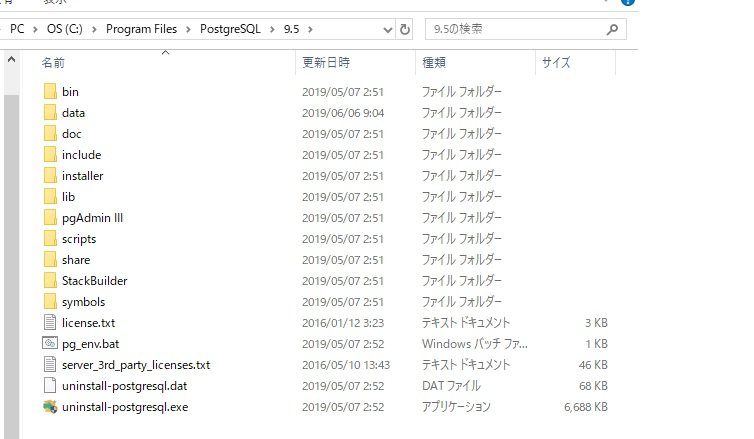

# PostgreSQLメモ
## 目次
- [構成](#構成)
- [設定](#設定)
- [データ型](#データ型一覧)
- [Postgresコマンド](#Postgresコマンド)
- [その他コマンド類](#その他コマンド類)
- [よく使う操作・コマンド](#よく使う操作およびコマンド)
- [用語集](#用語集)

## 概要
2019.6月時点ではPostgreSQL9.0が最新。
## 構成
PostgreSQLのファイル構成は図１の通り。普段触るのは大体dataフォルダ。  

||
|:---:|
|図１ PostgreSQL構成|
#### dataフォルダ
postgresが管理するデータを実際に記録する領域(=データベースクラスタ)。
このデータベースクラスタが無いと、PostgreSQLサーバーは起動できない。※１  
具体的な中身として主なものは、以下の通り。
なお、各設定ファイル詳細は後述の「設定」に記載する。
1. グローバルデータ
   - ユーザー情報など
2. システムが使用する領域
   - あ
3. 設定ファイル
   - postgresql.conf
     - 接続・認証/ハードリソース/ログ/レプリケーション/オプティマイザー等の設定ファイル
   - pg_hba.conf
     - ホストベース認証(接続元ホストのIP、接続先DB名、ユーザーなどの組み合わせ)の設定ファイル。
     - postgresql.confがDBが入っているマシンの設定に対し、これは接続相手に関する設定

4. DB
   - template0 : 文字通り、テンプレートとなるDB。これを元にユーザー作成のDBが作られる。変更不可。
   - template1 : 〃。変更可の為、ここに共通で引き継がせたい自作テンプレートを作れる。

>※１：initdbコマンドでDBクラスタが作れる。  
>　　　普段はインストーラが最初にやってくれている？？

#### lib  
- DLLファイル
#### scripts 
- windowsのスタートメニューからpsqlの起動やサーバの起動・停止を行うスクリプト
#### share 
- PostgreSQLに必要な様々な共有ファイル
### 

## 設定
#### postgresql.confの設定
コード抜粋してコメントで解説記載。
```postgres
#------------------------------------------------------------------------------
# CONNECTIONS AND AUTHENTICATION
#------------------------------------------------------------------------------
# - Connection Settings -
# TCP許可する場合、「liseten_addresses='*'」とする。
listen_addresses = '*'		# what IP address(es) to listen on;
					# comma-separated list of addresses;
					# defaults to 'localhost'; use '*' for all
					# (change requires restart)
# ポート設定
port = 5432				# (change requires restart)
# 最大接続数の設定
max_connections = 100			# (change requires restart)

```
## データ型一覧
| データ種別 | データ型         | 概要 | 
| :---:     | :---:             | ---  |
| 数値型     |integer           | 4バイト　-2,147,483,648～2147483647整数|
|           |smallint           | 2バイト　-32768～32647整数
|           | bigint            | 8バイト　-9223372036854775808～9223372036854775807整数
|           | real	           |4バイト　浮動小数(6桁精度)
|           | double precision | 8バイト　浮動小数(15桁制度)|
|           | serial            | 4バイト　1～2147483647に自動連番|
|文字型      | varchar[(n)]     | 可変長　最大n文字の長さ。文字分だけ格納。上限越えはエラー。
|           |char[(n)]          |固定長　指定文字列以下の場合、上限まで空白で埋められる。
|           |text               | 可変長　長さ無制限。
|日付/時刻　| date              |4バイト　日付
|          |time[(p)]          | 8バイト　時刻。※引数(p)は、秒の小数点以下の制度(0～6で指定)
|           |interval[(p)]      |12バイト　時間間隔
|           | timestamp[(p)]    |8バイト　日付と時刻療法
|ネットワークアドレス型|cidr |12or24バイト　IPv4 or IPv6ネットワーク
|           |inet           | 12or24バイト　IPv4 or IPv6ホスト、ネットワーク
|           |macaddr        |6バイト　MACアドレス

## Postgresコマンド
binフォルダ内にあるコマンド群。

```
//pg_ctl : postmasterの起動/停止

$ pg_ctl start
// 〃　停止
$ pg_ctl stop
// 〃　再起動
$ pg_ctl restart
```
```
//psql : SQLを対話的に実行するコマンド

#指定のファイルをリストアする。
$ psql -U "ユーザー名" -d "DB名" < ダンプファイル
```

```
//pg_dump : DBのバックアップ

//下記どちらでも可。やってることは同じ
$ pg_dump -U "ユーザー名" -f "ファイル名" -d "DB名" 
$ pg_dump -U "ユーザー名" -d "DB名" > ダンプファイル保存先/ファイル名

#スキーマのみダンプ
$ pg_dump -s 以下略...

#データのみダンプ
$ pg_dump -a 以下略...

#ダンプファイルの形式指定。Fの後に続くアルファベットで指定する。
#("c/t/p"がそれぞれ"カスタム/tar/テキスト"の順。指定しなければスクリプト形式になる)
$ pg_dump -Fc 以下略...

//運用中でもダンプできるらしいが、アクセスがあると排他ロックでどうにかなるので結局やらないほうがいいらしい。(追々調べる)

```
```
vacuumdb : VACUUMを実行する。


```

## バックスラッシュコマンド
| コマンド | 内容 |
|  :---:  | ---  |
|\q       | ログアウト|
|\l       |作成済みのデータベース一覧表示|
|\dn      | スキーマの一覧を表示|
|\du      | 現在のユーザーを表示。ロール名(ユーザーとグループをまとめたもの)が表示される。|
|\c      | 現在接続しているdbから他のdbへ接続する。ex.「\c db名」|
|\dt     |テーブル一覧表示|
|\d      | テーブル定義の確認。ex.「\d テーブル名」|
|\df      |関数の一覧を表示|
|\timing  | SQL実行時間計測表示のON/OFF|

## その他コマンド類
#### COPYコマンド
```postgres
//CSVファイルからテーブルにデータ挿入
COPY テーブル名 [列名[,列名...]] FROM 'ファイル名' CSV;

//テーブルからCSV形式でデータ抽出
COPY テーブル名 [列名[,列名...]] TO 'ファイル名' CSV;
```


  

## よく使う操作およびコマンド


#### スキーマ削除(リストア前)
```postgres
#publicスキーマごと削除し、publicスキーマだけ生成する。
$ DROP SCHEMA public cascade;
$ CREATE SCHEMA public;
```
#### リストア時に使用
```postgres

```

## 用語集
#### データベースクラスタ
1. 概要
- PostgreSQLが管理するデータを実際に記録する領域
- 実際には、ファイルシステム上にディレクトリが作成され、その中にposgreが管理する様々なファイルが作成される
- データベースクラスタの中には、DB、DB情報やユーザー情報など、すべてのDBに共通なデータも格納される。
- 通常、initdbコマンドで事前作成する必要があるが、インストール時に勝手にやってくれてる。(ソースコードからインストールした場合に必要)
- Postgresがメジャーバージョンアップした場合は、クラスタもバージョンアップ必要(ver間でクラスタ互換性がない)
2. template
- データベース作成時のテンプレートになるもの。
- initdbコマンド実行すると、クラスタ内にtemplate0とtemplate1が作成される
- template0は書き込みができない
- template1は書き込み可(ユーザーでカスタマイズできる)
- ユーザーがDB作成するときは、このtemplateを引き継いで作成される

#### 