# Powershell リモート操作
## 目次
- [文字化け..](#文字化けする時)
- [SSH:リモートログイン](#SSH)
- [SCP:リモートファイル転送](#SCP)
- [WOL:リモート起動](#WOL)
- [X-Windows:リモートGUI](#X-Windowsの利用)
- [VirtualBoxコマンド操作](#VirtualBoxコマンド操作)


## 文字化けする時
Powershellからリモートにログインした際、文字化けする場合は以下をそれぞれ試してみる。  

> Powershellのフォント変更
1. Powershellを起動し、下画像の赤丸内で右クリックし、プロパティを選択。  
2. 「フォント」タブのフォントでMSゴシックを選択。


> 文字コードの変更
1. Powershellで$OutputEncodingコマンドを打ち、文字コードを確認する。
2. リモート側のコンソール(or SSHログイン状態)で、```echo $LANG```打つ。
3. 1&2項で確認した文字コードに相違あれば、どちらかに統一する。    


## SSH
```shell
$ ssh -l リモートユーザー名 リモートホスト名(or IPアドレス)
```
- リモートサーバへログインするコマンド。telnetのセキュア版。(ウェルノウンポート：22)  
- サーバ側で、パスワードor秘密鍵の認証方式を設定できる。(デフォはパスワード？)　
- selinux有効だと、接続できなくなることがある。(/etc/selinux/config参照)
- sshの設定は/etc/ssh/sshd_config参照。
  
## SCP
```shell
//リモート⇒ローカルへコピー
$ scp リモートユーザー名@リモートホスト名:コピーしたいリモートのファイル名　ローカルのコピー先

//ローカル⇒リモートへコピー
$ scp ローカルのコピーしたいファイルパス　リモートユーザー名@リモートホスト名:コピー先パス
```
- リモート⇔ローカル間でファイル転送を行うときに使うコマンド。  
ローカル/リモートいずれに向けて行う場合でも、ローカル(自分)側でコマンドを実行する。※1
- ディレクトリをコピーする場合は、「-r」オプションを付ける。
- パスに漢字含まれているとエラーになる。
- リモート側の転送先は/home/ユーザー名が無難
- ディレクトリをコピーする場合は、「-r」オプションを付ける。

※1.scpは「sshを使ってファイル転送」する為、sshでログインする必要なし。SSH+FTPと思っておk？？

## WOL
Wake On LAN : ローカルからLAN経由でリモートマシンを起動することが出来るらしい。追々調べる...

## X-Windowsの利用
WindowsマシンからリモートのLinuxサーバのGUIを利用する。
#### 1. 準備
- Linux側(リモート)の準備
   - ssh-Server(リモートログインできる状態)
   - GUIがインストールされている。(ex.gnome)
- Windows側で用意するもの
   - Xming(下記URLのPublicDomainからDL)
   - Xming-fonts(同上)
    http://www.straightrunning.com/XmingNotes/
   - OpenSSH(OpenSSH-Win64.zip)
   https://github.com/PowerShell/Win32-OpenSSH/releases
#### 2. リモート側(Linux)
- sshd_conf編集
  /etc/ssh/sshd.confのX11Forwardingをyesにする。  
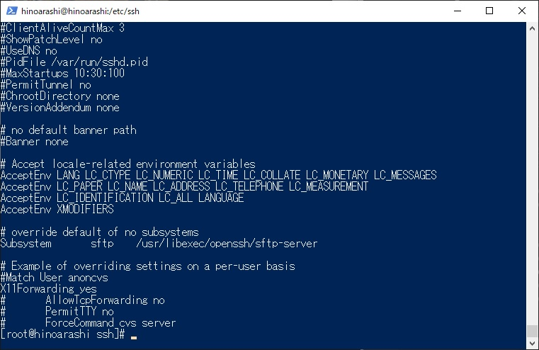

- $DISPLAYの設定
  ```shell
  $ echo $DISPLAY
  //表示が何もない(何も設定されていない)なら以下を実行する。

  $ export DISPLAY=localhost:0.0
  ```

#### 3. ローカル側(Windows)
- Xming,fontsインストール
　基本デフォルトで問題なし。(fontsも同様)
   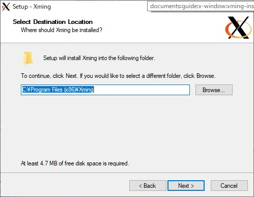
   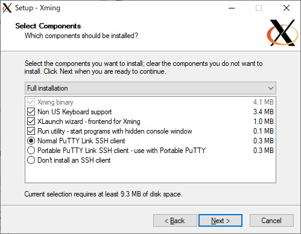
   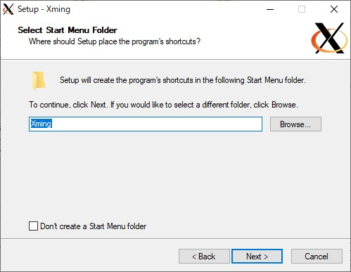
   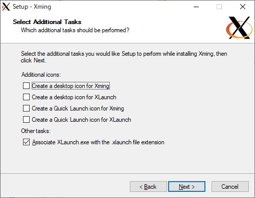  

- xmingの設定(xLanch)
  XLanchを起動し、以下の手順で設定を行う。
  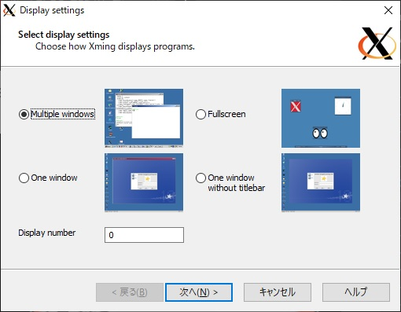
  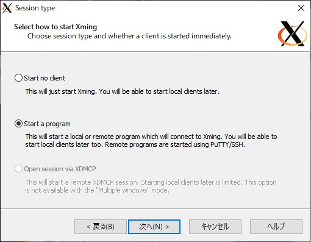
  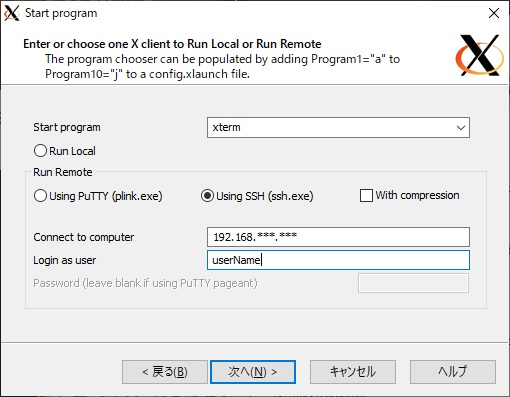
  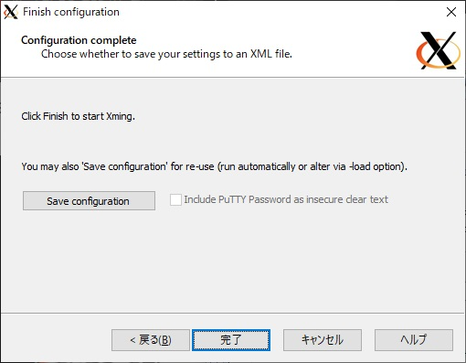

- xming(x0.hosts)の編集
  xmingフォルダ内のx0.hostsを開く。
  localhostの下にリモート接続するマシンのIPを追加する。

- ssh.exeのコピー
  DLしたOpenSSH-Win64.zipを解凍し、中にある"ssh.exe"をxmingフォルダ直下にコピーする。
  ※PuTTY使う場合は、plink.exeをコピーする。
　
　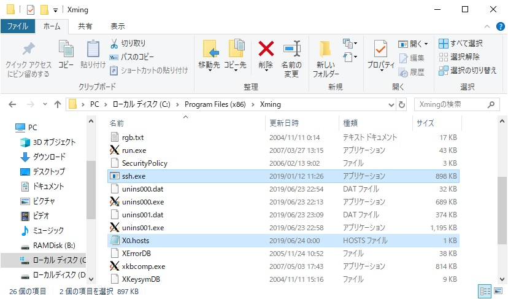

- teratermの設定
  teratermのメニューから「"設定"->"ssh転送"->"リモートの(X)アプリケーションをローカルのXサーバに表示するにチェックを入れる"->"OK"」
  その後、teratermを再起動する。
  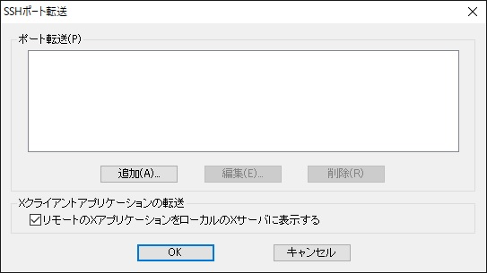

#### 4. 実行
以下の順で実行する。
1. xmingを起動する
2. teratermを起動しリモートログインする
3. GUIアプリケーションをコマンド起動する
   ```shell
   //最後に"&"をつける事
   $ firefox &
   ```
4. xmingでGUIが表示される

## VirtualBoxコマンド操作 
#### 起動フロー
1. ホストOSでVirtualBoxを起動 
2. VirtualBoxをコマンド操作し、ゲストOS(仮想マシン)を起動
3. ゲストOS上で好きな操作する
```shell
//ホストOS側の操作
$virtualbox
$vboxmanage startvm VM1 

//ゲストOS側の操作(例)
$service postgresql-9.5 start
```

#### 停止フロー
1. ゲストOSのシャットダウン操作
2. ホストOSシャットダウン操作

```shell
//ゲストOS
$shutdown -h now

//ホストOS
$shutdown -h now
```


#### コマンド説明
CUIでVirtualBox関係の操作をする時は`VBoxMange`コマンドを使う。  
主要なコマンドは以下の通り。


## サービス自動起動
```shell
//自動起動有効
systemctl enabled "サービス名"

//自動起動無効
systemctl disabled "サービス名"

//自動起動ステータス確認
sytemctl is-enabled "サービス名"

```