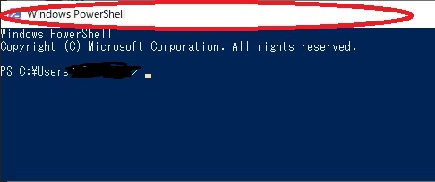

# Powershell リモート操作
## 目次
- [文字化け..](#文字化けする時)
- [SSH:リモートログイン](#SSH)
- [SCP:リモートファイル転送](#SCP)
- [WOL:リモート起動](#WOL)

## 文字化けする時
Powershellからリモートにログインした際、文字化けする場合は以下をそれぞれ試してみる。  

> Powershellのフォント変更
1. Powershellを起動し、下画像の赤丸内で右クリックし、プロパティを選択。  
2. 「フォント」タブのフォントでMSゴシックを選択。




> 文字コードの変更
1. Powershellで$OutputEncodingコマンドを打ち、文字コードを確認する。
2. リモート側のコンソール(or SSHログイン状態)で、```echo $LANG```打つ。
3. 1&2項で確認した文字コードに相違あれば、どちらかに統一する。    


## SSH
```shell
$ ssh -l リモートユーザー名 リモートホスト名(or IPアドレス)
```
- リモートサーバへログインするコマンド。telnetのセキュア版。(ウェルノウンポート：22)  
- サーバ側で、パスワードor秘密鍵の認証方式を設定できる。(デフォはパスワード？)　

## SCP
```shell
//リモート⇒ローカルへコピー
$ scp リモートユーザー名@リモートホスト名:コピーしたいリモートのファイル名　ローカルのコピー先

//ローカル⇒リモートへコピー
$ scp ローカルのコピーしたいファイルパス　リモートユーザー名@リモートホスト名:コピー先パス
```
- リモート⇔ローカル間でファイル転送を行うときに使うコマンド。  
ローカル/リモートいずれに向けて行う場合でも、ローカル(自分)側でコマンドを実行する。※1
- ディレクトリをコピーする場合は、「-r」オプションを付ける。

※1.scpは「sshを使ってファイル転送」する為、sshでログインする必要なし。SSH+FTPと思っておk？？

## WOL
Wake On LAN : ローカルからLAN経由でリモートマシンを起動することが出来る。  
設定は以下の手順。
